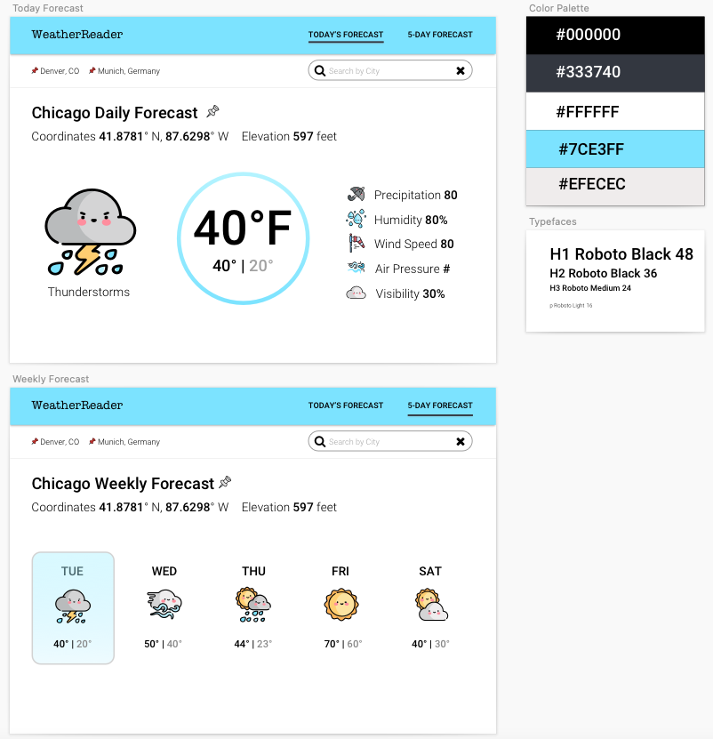

<h1 align="left">WeatherForecaster</h1>

    
     
  

## Table of Contents

* [About the Project](#about-the-project)
* [Final Product](#final-product)
* [Installation](#installation)
* [Persona](#persona)
* [Wireframes](#wireframes)
* [Functionality](#functionality)
* [Project Goals](#project-goals)
* [Technologies Used](#technologies-used)
* [Contact the Creator](#contact-the-creator)

## About the Project
WeatherForecaster is designed to bring joy to those needing to check the weather for their day.  

## Final Product:
##### Today's Forecast Page:

##### Weekly Forecast Page:

## Installation
1. Fork this repository.
2. Clone it down to your local machine with `git clone <your SSH Key>`.
3. Navigate into the directory.
4. Run `npm install` to compile the React application.
5. Run `npm start` to see the app running locally.

## Persona

## Wireframes

## Functionality
* [Today's Forecast](#todays-forecast)
* [Weekly Forecast](#weekly-forecast)
* [Search Location](#search-location)
* [Pin City](#pin-city)
* [Accessibility](#accessibility)
* [Error Handling](#error-handling)

#### Today's Forecast
  - When a user visits the site, they are able to view the default weather location that gives specifics about the weather, such as the current temperature, high and lows of the day, weather conditions, and other details.  

#### Weekly Forecast
  - When a user clicks on the weekly forecast tab, they are able to view the 7 day forecast for their specified location. 

< img src = "https://media.giphy.com/media/Oz5VP9byKeowxtL6RO/giphy.gif" width = "1440" >

#### Search Location
 - Because not everyone lives in the same city, users are able to search for their desired location via the search bar. Upon entering their city, the page will reload with that city's information. If the city is not found in the API, a message will appear to urge them to search for a different city.

< img src = "https://media.giphy.com/media/mHbdW6C1S3EMJb1DQz/giphy.gif" width = "1440" >

#### Pin City
- To create a better user experience, the user can 'pin', or save, a city. Their pinned cities will be easily accessible to them in the subheader. The pin can be removed at anytime by clicking the pin. If the user would like to search by the pinned location, they simply have to click on the location name. 

< img src = "https://media.giphy.com/media/Es7EH9LGcXyXDsN4L3/giphy.gif" width = "1440" >

#### Accessibility 

WeatherForecaster received 100% acecessibility audit from Lighthouse.

#### Error Handling
Dynamic error handling is used so that a user will receive a specific error message based on the error type.

## Project Goals

- Create an accessible app that has a clean UI and simple UX.
- Create a multi-page UX using React Router.
- Testing User Stories using `Cypress`.
- Gain competency with React and create multipage using Router.
- Learn and implement TypeScript on front-end and back-end.
- Make network requests to API endpoints to retrieve and manipulate data.
- Use Object Oriented Programming (OOP) to drive the design of the application and the code.
- Ensure the app is following best accessibility practices.
- Leverage SASS to DRY up CSS.

## Technologies Used

- 
- 
- 
- 
- 
- 
- 

## Contact the Creator
[][linkedin]
[][github]

<!-- Personal Definitions  -->

[linkedin]: https://www.linkedin.com/in/anneke-miers/
[github]: https://github.com/aemiers
